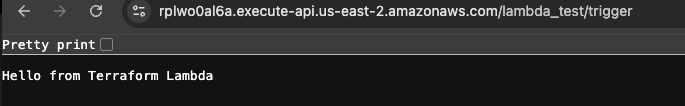

# Terraform - API Gateway Triggering Lambda

This Terraform configuration sets up:

- An IAM role for Lambda
- A Python-based Lambda function
- API Gateway with a `/trigger` resource and GET method
- Integration between API Gateway and Lambda
- Permissions for API Gateway to invoke Lambda

## How to Deploy

Run:

```bash
terraform apply

You will be prompted to enter:

- `accountId` – your AWS Account ID  
- `myregion` – AWS region (e.g., `us-east-2`)

## How to Trigger the Lambda

1. Open **API Gateway** in AWS Console.  
2. Find the API named **LambdaAPIGateway**.  
3. **Deploy the API** (if not already deployed).  
4. Under **Stages**, select the stage named **lambda_test**.  
5. Copy the **Invoke URL** shown for the stage.  
6. Append `/trigger` to the URL.

Example:  
https://<api-id>.execute-api.<region>.amazonaws.com/lambda_test/trigger


7. Open the URL in a browser or use `curl` to trigger the Lambda function and see the response.




